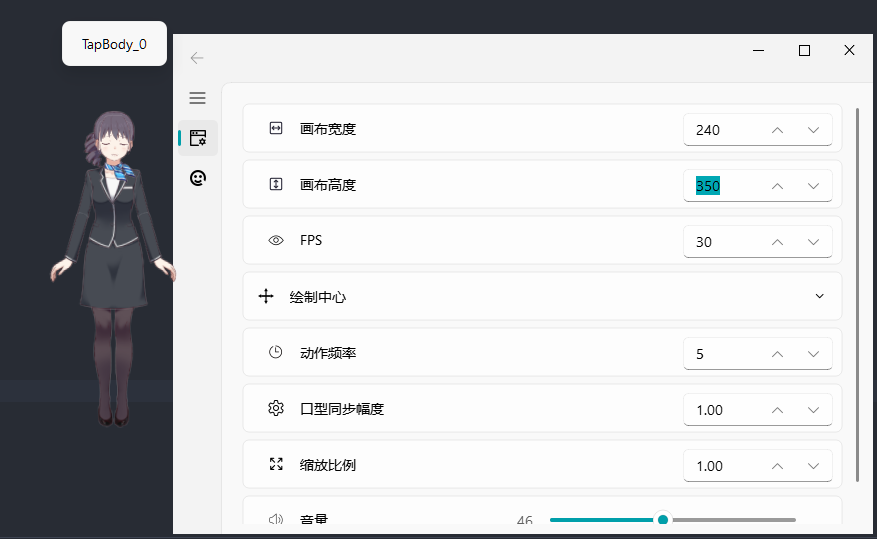

# Live2D Desktop Mascot (Python)
本项目基于https://github.com/Arkueid/Live2DMascot上增加进行本地Ollama api调用。
并部分修改源码，将tts加入到模型中。
放弃Cubism 2.x的支持。
将源码中的所有pyside2库修改为pyside6。


基于[live2d-py](https://github.com/Arkueid/live2d-py)。


支持 Live2D 模型版本：
* Cubism 3.0 及以上导出的模型：文件名格式常为 `XXX.moc3`，`XXX.model3.json`, `XXX.motion3.json` 


运行环境：Python 3.11.10 Win32

若使用 Linux 或 64 位 Python，或有其他 Python 版本需求，需要拉取 [live2d-py](https://github.com/Arkueid/live2d-py) 的源码自行编译。


3.0 版本模型（仓库中使用的`live2d-py`版本对应`python-win64-3.12.0+`，其他版本需要自行编译`live2d-py`）：


聊天功能：（目前使用百度千帆，使用其他大模型需要自行编写 `client`，继承 [chat/client/chat_client](./chat/client/chat_client.py) 中的 `ChatClientWithCache`。


## 运行
### live2d 文件格式：

只要 `XXX.modelX.json` 文件路径正确即可，其他文件通过该 `json` 文件读取。

`.bak` 文件为运行时自动生成的备份文件。

v2 版本

```shell
Resources\v2\kasumi2
|-- kasumi2.model.json # 只需要确保目录下有该文件
|-- kasumi2.model.json.bak
`-- live2d
    |-- 001_general_angry01.exp
    |-- 001_general_angry01.mtn
    |-- 001_general_bye01.mtn
    |-- 001_general_cry01.exp
    |-- 001_general_cry01.mtn
    ...
```

v3 版本

```shell
esources\v3\Haru
|-- Haru.2048
|   |-- texture_00.png
|   `-- texture_01.png
|-- Haru.cdi3.json
|-- Haru.moc3
|-- Haru.model3.json  # 只需要确保目录下有该文件
|-- Haru.model3.json.bak
|-- Haru.physics3.json
|-- Haru.pose3.json
|-- Haru.userdata3.json
|-- expressions
|   |-- F01.exp3.json
|   |-- F02.exp3.json
|   ...
|   |-- F06.exp3.json
|   |-- F07.exp3.json
|   `-- F08.exp3.json
|-- motions
|   |-- haru_g_idle.motion3.json
|   |-- haru_g_m01.motion3.json
|   |-- haru_g_m02.motion3.json
|   ...
|   |-- haru_g_m23.motion3.json
|   |-- haru_g_m24.motion3.json
|   `-- haru_g_m26.motion3.json
`-- sounds
    |-- haru_Info_04.wav
    |-- haru_Info_14.wav
    |-- haru_normal_6.wav
    `-- haru_talk_13.wav
```

### 运行步骤
1. 安装 Python 3.11.10

2. 安装 Python 库

```python
pip install pyside6 pyside6-fluent-widgets
```

或

```shell
pip install -r requirements.txt
```

3. 设置版本
由于作者能力有限，即使取消了对Cubism 2.x的支持，但依然需要对模型版本进行修改。
在 [app/settings.py](./app/settings.py) 中设置 `APP_MODE` 变量和 `LIVE2D_VERSION` 变量，来配置是否打印执行信息，切换支持的 live2d 模型版本。

4. 运行 `main.py`

